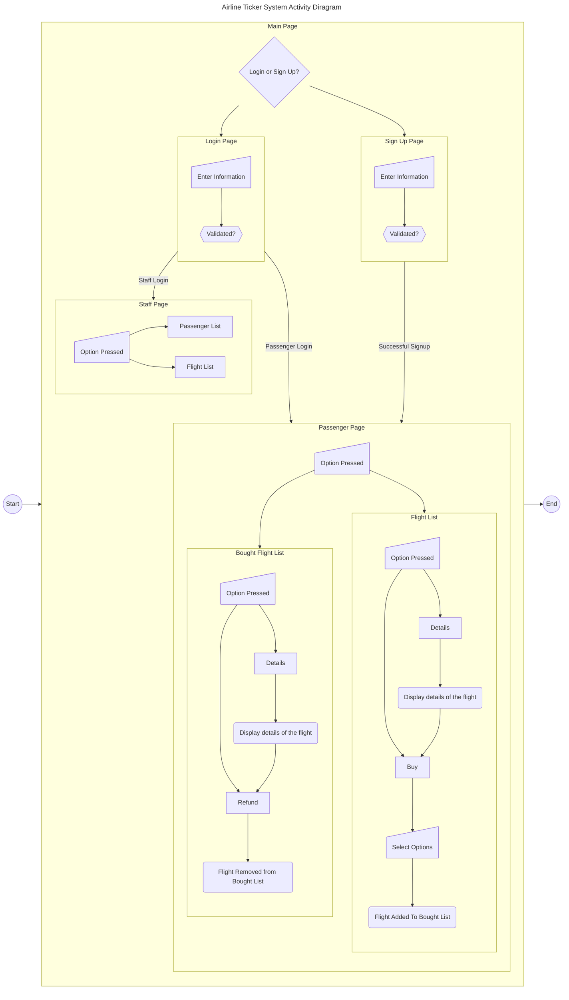

# This is the Activity Diagram for our AppDev Airline Ticket System Project

```mermaid
---
title: Airline Ticker System Activity Diragram
---
flowchart LR
    %% START AND END
    START@{ shape: circle, label: "Start" }
    END@{ shape: circle, label: "End" }

    %% main page subgraph
    main-choice@{ shape: diamond, label: "Login or Sign Up?" }

    %% login page subgraph
    enter-login@{ shape: manual-input, label: "Enter Information"}
    validate-login@{ shape: hex, label: "Validated?"}

    %% signup page subgraph
    enter-signup@{ shape: manual-input, label: "Enter Information"}
    validate-signup@{ shape: hex, label: "Validated?"}

    %% staff page subgraph
    staff-option@{ shape: manual-input, label: "Option Pressed"}
    staff-passenger-list@{ shape: process, label: "Passenger List"}
    staff-flight-list@{ shape: process, label: "Flight List"}

    %% passenger page subgraph
    passenger-option@{ shape: manual-input, label: "Option Pressed"}
        %% flight list subgraph
        passenger-flight-list-option@{ shape: manual-input, label: "Option Pressed"}
        passenger-flight-list-buy@{ shape: process, label: "Buy"}
        passenger-flight-list-buy-select@{ shape: manual-input, label: "Select Options"}
        passenger-flight-list-buy-event@{ shape: event, label: "Flight Added To Bought List"}
        passenger-flight-list-details@{ shape: process, label: "Details"}
        passenger-flight-list-details-event@{ shape: event, label: "Display details of the flight"}

        
        %% bought list subgraph
        passenger-bought-list-option@{ shape: manual-input, label: "Option Pressed"}
        passenger-bought-list-refund@{ shape: process, label: "Refund"}
        passenger-bought-list-refund-event@{ shape: event, label: "Flight Removed from Bought List"}
        passenger-bought-list-detail@{ shape: process, label: "Details"}
        passenger-bought-list-detail-event@{ shape: event, label: "Display details of the flight"}


    START --> main
    subgraph main[Main Page]
        direction TB
        main-choice --> login
        main-choice --> signup

        subgraph login[Login Page]
            direction TB
            enter-login --> validate-login
        end
        login -- Staff Login --> staff
        login -- Passenger Login ---> passenger

        subgraph signup[Sign Up Page]
            direction TB
            enter-signup --> validate-signup
        end
        signup -- Successful Signup ---> passenger

        subgraph staff[Staff Page]
            direction LR
            staff-option --> staff-passenger-list
            staff-option --> staff-flight-list
        end

        subgraph passenger[Passenger Page]
            direction TB
                passenger-option --> passengerflightlist
                passenger-option --> passengerboughtlist

                subgraph passengerflightlist[Flight List]
                    direction TB
                    passenger-flight-list-option --> passenger-flight-list-buy
                    passenger-flight-list-buy --> passenger-flight-list-buy-select
                    passenger-flight-list-buy-select --> passenger-flight-list-buy-event

                    passenger-flight-list-option --> passenger-flight-list-details
                    passenger-flight-list-details --> passenger-flight-list-details-event
                    passenger-flight-list-details-event --> passenger-flight-list-buy
                end

                subgraph passengerboughtlist[Bought Flight List]
                    direction TB
                    passenger-bought-list-option --> passenger-bought-list-refund
                    passenger-bought-list-refund --> passenger-bought-list-refund-event

                    passenger-bought-list-option --> passenger-bought-list-detail
                    passenger-bought-list-detail --> passenger-bought-list-detail-event
                    passenger-bought-list-detail-event --> passenger-bought-list-refund
                end
                
        end
    end
    main --> END
```