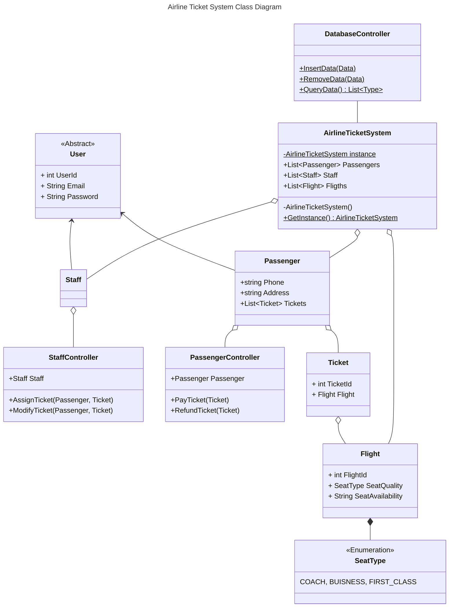

# This is the Class Diagram for our AppDev Airline Ticket System Project

```mermaid
---
title: Airline Ticket System Class Diagram
---
classDiagram
    %% Controller 
    class DatabaseController {
        +InsertData(Data)$
        +RemoveData(Data)$
        +QueryData()$ List~Type~
    }

    class StaffController {
        +Staff Staff
        +AssignTicket(Passenger, Ticket)
        +ModifyTicket(Passenger, Ticket)
    }
    
    class PassengerController {
        +Passenger Passenger
        +PayTicket(Ticket)
        +RefundTicket(Ticket)
    }

    %% Singleton
    class AirlineTicketSystem {
        -AirlineTicketSystem instance$
        +List~Passenger~ Passengers
        +List~Staff~ Staff
        +List~Flight~ Fligths

        -AirlineTicketSystem()
        +GetInstance()$ AirlineTicketSystem
    }

    %% Model
    class User {
        + int UserId
        + String Email
        + String Password
    }
    <<Abstract>> User
    
    class Staff {
        %% IDK WHAT
    }

    class Passenger {
        +string Phone
        +string Address
        +List~Ticket~ Tickets
    }

    class Flight {
        + int FlightId
        + SeatType SeatQuality
        + String SeatAvailability
    }

    class SeatType {
        COACH, BUISNESS, FIRST_CLASS
    }
    <<Enumeration>> SeatType

    class Ticket {
        + int TicketId
        + Flight Flight
    }

    %% Relationships
    User <-- Passenger
    User <-- Staff
    Passenger o-- Ticket
    Ticket o-- Flight
    DatabaseController -- AirlineTicketSystem
    AirlineTicketSystem o-- Passenger
    AirlineTicketSystem o-- Staff
    AirlineTicketSystem o-- Flight
    Flight *-- SeatType
    Passenger o-- PassengerController
    Staff o-- StaffController
```