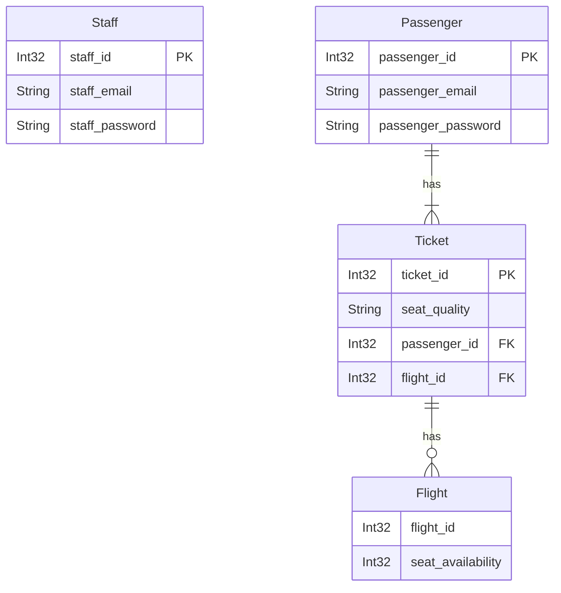

# This is the ERD for our AppDev Airline Ticket System Project

```mermaid
erDiagram
    %% Staff will be created by "Admin" (outside of our program)
    Staff {
        Int32 staff_id PK
        String staff_email
        String staff_password
    }
    
    Passenger {
        Int32 passenger_id PK
        String passenger_email
        String passenger_password
    }

    %% Flight will be created by "Admin" (outside of our program)
    Flight {
        Int32 flight_id
        Int32 seat_availability
    }

    Ticket {
        Int32 ticket_id PK
        String seat_quality
        Int32 passenger_id FK
        Int32 flight_id FK
    }

    Passenger ||--|{ Ticket : has
    Ticket ||--o{ Flight: has
```